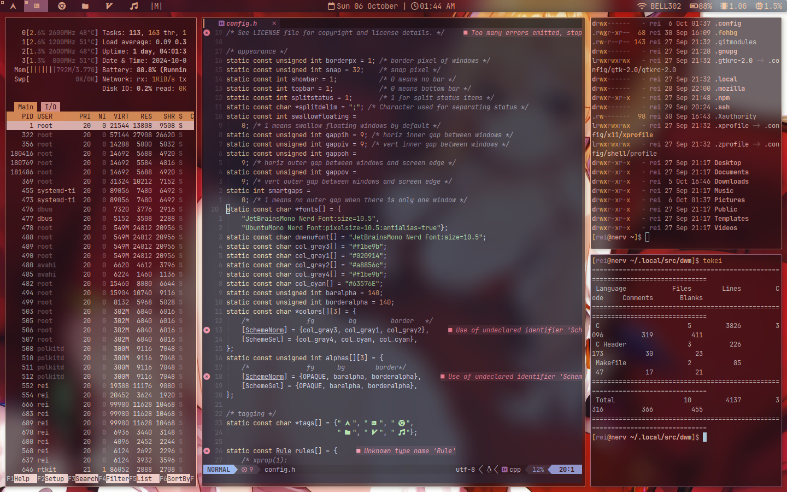

# Dwm
my fork of suckless dwm





# Patches
- vanity gaps
- layouts (centered master, fibonacci, bstack,gapless grid. horiz grid)
- Actual full screen
- Swallow
- Alpha (for dwm bar transpareny)
- Notitle
- Attach below (with tab binding)
- Splitstatus (used to get date and time in the center of the bar)
- Always center
- Sticky

# Requirements

```
yay -S gcc git ttf-jetbrains-mono-nerd base-devel xorg-server xorg-xinit xdotool libx11 libxinerama libxft xorg 
```

## optional
```
yay -S kitty pywal xwallpaper picom acpi sysstat wireless_tools zsh
```

# Installation

```
git clone https://github.com/fruitsaladchan/dwm.git
cd dwm
sudo make install
```
if you want to make changes to the configuration you need to edit config.h and recompile it with 

```
sudo make
sudo make install
```

# Extra

- i am using [luke smiths dmenu](https://github.com/LukeSmithxyz/dmenu)
- im also using kitty for my terminal + pywal
- if you want my bar move the dwmbar.sh in your ~/.local/bin/ and start it up with xinitrc
- i am using [brillo](https://github.com/CameronNemo/brillo) for brightness with a changebrighess script 
- i am also using picom with this setup to get animations and blurred terminals. if you want to use my config move the [picom.conf](https://github.com/fruitsaladchan/dwm/blob/7f8b67d6ca94f382b02d17053103163ee7562e52/config/picom.conf) to ~/.config/picom/

