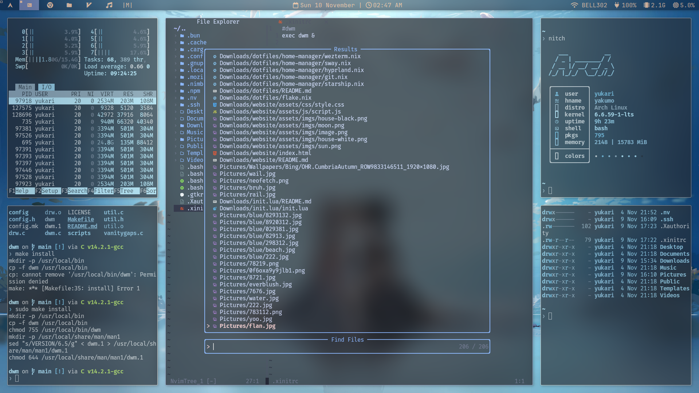
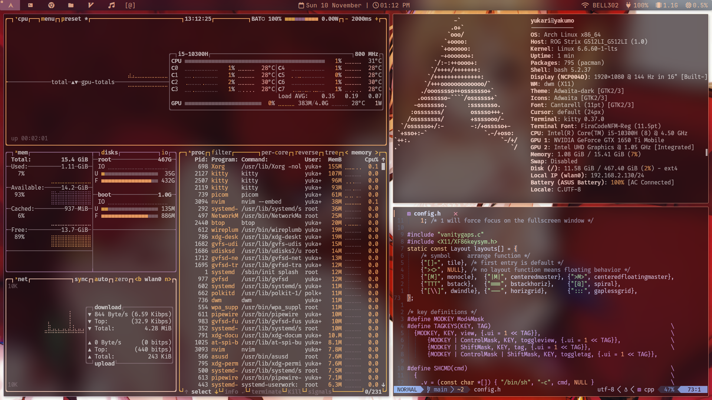
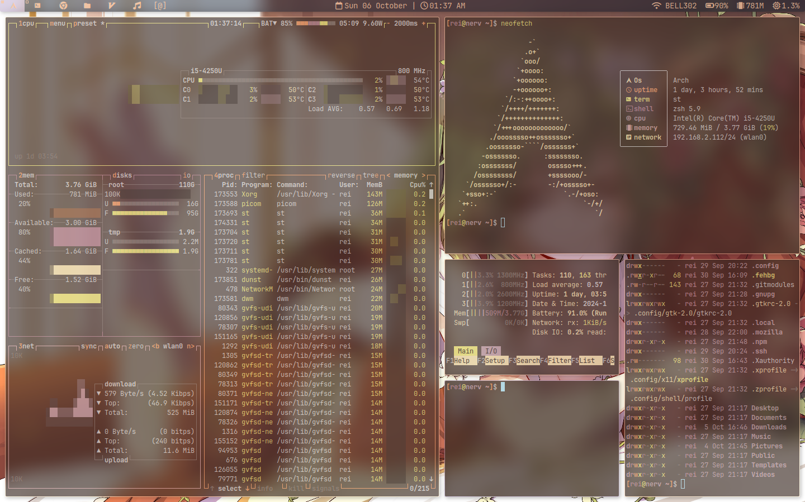

# Dwm
## my fork of suckless dwm








# Patches
- vanity gaps
- layouts (centered master, fibonacci, bstack,gapless grid. horiz grid)
- Actual full screen
- Swallow
- Alpha (for dwm bar transpareny)
- Notitle
- Attach below (with tab binding)
- Splitstatus (used to get date and time in the center of the bar)
- Always center
- Sticky
- pertag
- underline tags
- movestack

# Requirements

```
yay -S gcc git ttf-jetbrains-mono-nerd base-devel xorg-server xorg-xinit xdotool libx11 libxinerama libxft xorg 
```

## optional
```
yay -S kitty pywal xwallpaper picom acpi sysstat wireless_tools zsh flameshot lm_sensors
```

# Installation

```
git clone https://github.com/fruitsaladchan/dwm.git
cd dwm
sudo make
sudo make install
```
if you want to make changes to the configuration you need to edit config.h and recompile it with 

```
sudo make
sudo make install
```

# Extra

- i am using [luke smiths dmenu](https://github.com/LukeSmithxyz/dmenu)
- im also using kitty for my terminal + pywal (move [kitty.conf](https://github.com/fruitsaladchan/dwm/tree/main/config/kitty) to ```~/.config/kitty/``` if yo uwant to use my config)
- if you want my bar move the dwmbar.sh in your ~/.local/bin/ and start it up with xinitrc (you can change which modules to use by editing line 125)
- i am using [brillo](https://github.com/CameronNemo/brillo) for brightness with [this script](https://github.com/fruitsaladchan/dwm/blob/main/scripts/changebrightness) 
- i am also using picom with this setup to get animations and blurred terminals. if you want to use my config move the [picom.conf](https://github.com/fruitsaladchan/dwm/blob/main/config/picom/picom.conf) to ```~/.config/picom/```


# useful keybinds
- super + return = spawn kitty
- super + z/x = inc/dec gaps
- super + a = toggle gaps
- super + d = dmenu
- super + t/y/u/i/ = switch layouts
- super + w = toggle floating
- super + space = zoom 
